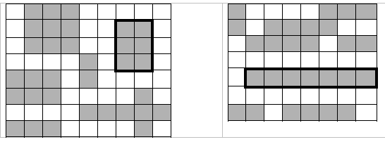

# Задача 2 - 21

Для переданного двумерного массива логических элементов, найти наибольший по площади прямоугольник,
который полностью состоит из истинных значений, окруженный ложными значениями или границами массива.

Если существует несколько таких прямоугольников максимальной площади, вернуть самый верхний
(по верхнему левому углу), затем самый левый.

На картинках ниже обведены такие прямоугольники для входного массива (закрашенные клетки – истина, белые – ложь):